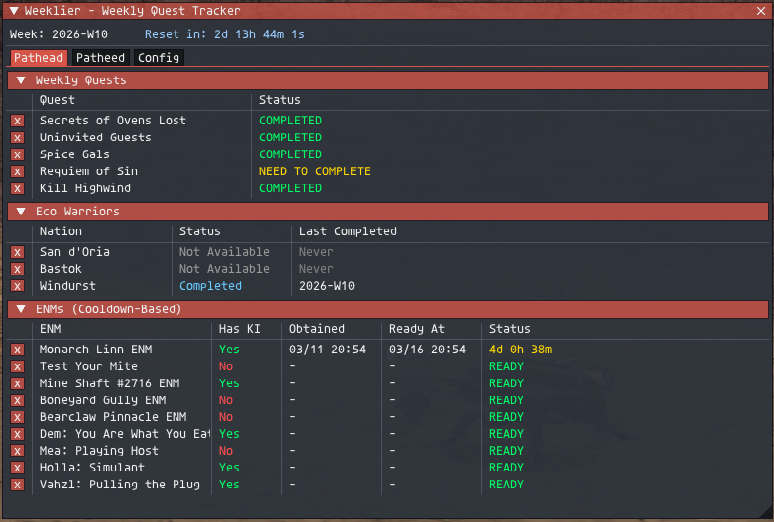

# Weeklier

An [Ashita v4](https://www.ashitaxi.com/) addon for [HorizonXI](https://horizonxi.com/) that tracks weekly quest completion across all of your characters.

## Features

- **Multi-character tracking** - Quest status is persisted to JSON so you can view progress for all characters from any character.
- **Automatic detection** - Status is derived from live packet data (key items via `0x055`, quest log via `0x056`) and chat message parsing. No manual check-offs needed.
- **Weekly reset countdown** - Displays the current week and a live countdown to the next reset (midnight Monday JST / Sunday 15:00 UTC).
- **ImGui UI** - Tabbed interface with a tab per character, collapsible sections, and color-coded statuses.
- **Configurable** - Add or remove quests by editing the `QUESTS` table in the Lua file.

## Screenshot



## Tracked Content

### Weekly Quests

Standard weekly quests with automatic status progression:

| Status | Meaning |
|---|---|
| NOT STARTED | Quest has not been flagged this week |
| NEED TO COMPLETE | Quest is active (flagged, has entry KI) |
| READY TO TURN IN | Objective complete, needs to be turned in to NPC |
| COMPLETED | Quest turned in for the week |

Pre-configured quests:
- Secrets of Ovens Lost
- Uninvited Guests
- Spice Gals
- Requiem of Sin

### ENMs (Cooldown-Based)

ENMs have an independent cooldown timer (typically 5 days) rather than following the weekly reset. The addon tracks when the key item was obtained and displays a countdown until the next one can be acquired.

Pre-configured ENMs:
- Monarch Linn ENM
- Test Your Mite
- Mine Shaft #2716 ENM
- Boneyard Gully ENM
- Bearclaw Pinnacle ENM
- Dem: You Are What You Eat
- Mea: Playing Host
- Holla: Simulant
- Vahzl: Pulling the Plug

### Kill-Based Quests

Weekly NMs that are completed simply by killing them and receiving experience points. Detection uses a two-step confirmation: a "defeats the X" message followed by an XP gain message within a short time window.

Pre-configured:
- Kill Highwind

### Eco Warriors

A special round-robin system tracking the three Eco Warrior quests (San d'Oria, Bastok, Windurst). Only one nation can be completed per week, and each nation must be completed before repeating one. The addon tracks the rotation and shows which nations are available.

| Status | Meaning |
|---|---|
| Available | Can be flagged this week |
| Flagged | Quest is currently active |
| Completed | Completed this week |
| Not Available | Another nation was done this week, or this nation must wait its turn |

A manual override is available in the Config tab to bootstrap the round-robin cycle for existing characters.

## Detection Methods

The addon uses multiple detection methods depending on the quest type:

- **Packet 0x055 (Key Items)** - Monitors the key item bitmap to detect when quest-related KIs are obtained or removed. KI removal is used to detect quest completion or objective completion.
- **Packet 0x056 (Quest Log)** - Reads the active quest bitmap to determine if a quest is currently flagged.
- **Chat parsing** - Some quests use chat message detection as a fallback for bugged quests that don't appear correctly in the quest log.

## Installation

1. Copy the `weeklier` folder into your Ashita `addons` directory.
2. Load the addon in-game: `/addon load weeklier`

## Commands

| Command | Description |
|---|---|
| `/weeklier show` | Toggle the tracker window (default) |
| `/weeklier hide` | Close the tracker window |
| `/weeklier status` | Print quest status to chat log |
| `/weeklier reset` | Reset current character's quest data for this week |
| `/weeklier resetall` | Clear ALL character data |
| `/weeklier debug` | Toggle debug logging |
| `/weeklier dump` | Dump current packet state for diagnostics |
| `/weeklier help` | Show help text |

## Configuration

### Adding Quests

Edit the `QUESTS` table near the top of `weeklier.lua`. Each quest entry supports the following fields:

```lua
{
    name                = 'Quest Name',           -- Display name (required)
    type                = nil,                    -- nil for standard, 'enm', or 'kill_mob'

    -- Quest log detection (packet 0x056)
    quest_log_id        = 4,                      -- Log ID (0=Sandy, 1=Bastok, 2=Windy, 3=Jeuno, etc.)
    quest_id            = 73,                     -- Quest ID within that log (0-255)

    -- Key item detection (packet 0x055)
    ki_quest_active     = 'KEY_ITEM_NAME',        -- KI received on quest accept
    ki_active_is_completion = false,              -- If true, KI removal = COMPLETED (no turn-in)
    ki_quest_incomplete = 'KEY_ITEM_NAME',        -- KI held until turn-in

    -- Chat-based detection (fallback for bugged quests)
    flag_phrase         = 'npc dialogue text',    -- Chat text when quest is flagged
    complete_phrase     = 'npc dialogue text',    -- Chat text when quest is completed
}
```

### Hiding Quests

Click the `x` button next to any quest in the UI to hide it. Hidden quests can be restored from the Config tab.

## Data Storage

All data is saved to `char_data.json` in the addon directory. This includes per-character quest status, ENM cooldown timers, Eco Warrior rotation history, and UI preferences (hidden quests).

## Dependencies

- [Ashita v4](https://www.ashitaxi.com/)
- `data/key_item.lua` - Key item name-to-ID mapping (included)

## License

This project is provided as-is for use with HorizonXI.

