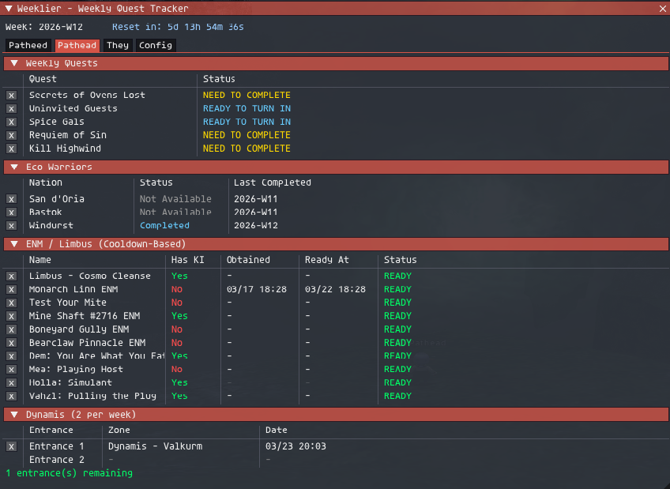

# Weeklier

An [Ashita v4](https://www.ashitaxi.com/) addon for [HorizonXI](https://horizonxi.com/) that tracks weekly quest completion across all of your characters.
Now officially approved for use! (may not appear on the approved addon list yet)

## Features

- **Multi-character tracking** - Quest status is persisted to JSON so you can view progress for all characters from any character.
- **Automatic detection** - Status is derived from live packet data (key items via `0x055`, quest log via `0x056`, zone-in via `0x00A`) and chat message parsing. No manual check-offs needed.
- **Weekly reset countdown** - Displays the current week and a live countdown to the next reset (midnight Monday JST / Sunday 15:00 UTC).
- **ImGui UI** - Tabbed interface with a tab per character, collapsible sections, and color-coded statuses.
- **Configurable** - Add or remove quests by editing the `QUESTS` table in the Lua file.

## Screenshot



## Tracked Content

### Weekly Quests

Standard weekly quests with automatic status progression:

| Status | Meaning |
|---|---|
| NOT STARTED | Quest has not been flagged this week |
| NEED TO COMPLETE | Quest is active (flagged, has entry KI) |
| READY TO TURN IN | Objective complete, needs to be turned in to NPC |
| COMPLETED | Quest turned in for the week |

Pre-configured quests:
- Secrets of Ovens Lost
- Uninvited Guests
- Spice Gals
- Requiem of Sin

### ENM / Limbus (Cooldown-Based)

ENMs and Limbus have an independent cooldown timer rather than following the weekly reset. ENMs typically have a 5-day cooldown, while Limbus has a 3-day cooldown. The addon tracks when the key item was obtained and displays a countdown until the next one can be acquired.

Pre-configured ENMs:
- Monarch Linn ENM
- Test Your Mite
- Mine Shaft #2716 ENM
- Boneyard Gully ENM
- Bearclaw Pinnacle ENM
- Dem: You Are What You Eat
- Mea: Playing Host
- Holla: Simulant
- Vahzl: Pulling the Plug

Pre-configured Limbus:
- Limbus (Cosmo-Cleanse, 3-day cooldown)

### Kill-Based Quests

Weekly NMs that are completed simply by killing them and receiving experience points. Detection uses a two-step confirmation: a "defeats the X" message followed by an XP gain message within a short time window.

Pre-configured:
- Kill Highwind

### Eco Warriors

A special round-robin system tracking the three Eco Warrior quests (San d'Oria, Bastok, Windurst). Only one nation can be completed per week, and each nation must be completed before repeating one. The addon tracks the rotation and shows which nations are available.

| Status | Meaning |
|---|---|
| Available | Can be flagged this week |
| Flagged | Quest is currently active |
| Return to NPC | KI obtained, needs in-zone verification before turning in |
| Need To Complete | Verified in-zone, return to quest giver to complete |
| Completed | Completed this week |
| Not Available | Another nation was done this week, or this nation must wait its turn |

A manual override is available in the Config tab to bootstrap the round-robin cycle for existing characters.

### Dynamis

Tracks Dynamis entries (up to 2 per week per character, same weekly reset). The addon detects zone-ins to any Dynamis zone via the `0x00A` packet and records the zone name and timestamp.

To prevent leaving and re-entering the same Dynamis zone from counting as a second entry, the addon tracks the active session timer by parsing system chat messages:
- "You will be expelled from Dynamis in X minutes (Earth time)." - sets the session expiry
- "Your stay in Dynamis has been extended by X minutes." - extends the session expiry

While the session timer is still running, subsequent zone-ins are treated as re-entries and are not counted.

Supported zones:
- Dynamis - Valkurm, Buburimu, Qufim, Tavnazia
- Dynamis - Beaucedine, Xarcabard
- Dynamis - San d'Oria, Bastok, Windurst, Jeuno

### Assault Tags

Tracks the Assault tag stock (banked Imperial Army I.D. tags). Tags are a server-side counter rather than a key item, so the only way to read them is to **talk to Rytaal in Aht Urhgan Whitegate** - the section shows "Unknown" until you do. One visit is enough: the addon stores the restock timer the NPC sends and projects the stock forward from it, so the count and countdowns stay correct without going back.

The section shows the current stock and cap, time until the next tag, time until the stock is full, whether you are carrying an undrawn tag, and which assault you are registered for (by name and staging point, e.g. `Seagull Grounded (Periqia)`).

Tags restock up to a cap of 3 (or 4 at Second Lieutenant with every assault completed). The cap is not in the packet, so it is learned from the highest stock seen.

The restock period is not in the packet either. It is 24 hours on HorizonXI and on retail / upstream LandSandBoat, which is the default, but it can be changed per install for servers that tune it:

```
/weeklier assaultperiod <hours>
```

Restocks land on a fixed time of day, set by the draw that started the timer. The addon derives the schedule from that time of day rather than from the packet's absolute timestamp, because on HorizonXI that timestamp arrives exactly one period early - verified against `Obtained key item: Imperial Army I.D. tag` chatlog lines. Using only the time of day makes the countdown immune to that offset.

A count projected past what the server actually reported is marked `(est.)`, and the `Last read` row always shows the raw value.

## Detection Methods

The addon uses multiple detection methods depending on the quest type:

- **Packet 0x055 (Key Items)** - Monitors the key item bitmap to detect when quest-related KIs are obtained or removed. KI removal is used to detect quest completion or objective completion.
- **Packet 0x056 (Quest Log)** - Reads the active quest bitmap to determine if a quest is currently flagged.
- **Packet 0x00A (Zone-In)** - Detects when the player enters a Dynamis zone to track weekly entrances.
- **Packet 0x034 (NPC Event)** - Reads the Assault tag stock and restock timer from Rytaal's event parameters. Matched on event id 268 in Aht Urhgan Whitegate rather than on the NPC id, which is not guaranteed to be identical across servers.
- **Chat parsing** - Detects quest flag/completion phrases for bugged quests that don't appear correctly in the quest log. Also used to track Dynamis session timers (injected system messages) and Eco Warrior in-zone verification steps.

## Installation

1. Copy the `weeklier` folder into your Ashita `addons` directory.
2. Load the addon in-game: `/addon load weeklier`

## Commands

| Command | Description |
|---|---|
| `/weeklier show` | Toggle the tracker window (default) |
| `/weeklier hide` | Close the tracker window |
| `/weeklier status` | Print quest status to chat log |
| `/weeklier reset` | Reset current character's quest data for this week |
| `/weeklier resetall` | Clear ALL character data |
| `/weeklier debug` | Toggle debug logging |
| `/weeklier dump` | Dump current packet state for diagnostics |
| `/weeklier help` | Show help text |

## Configuration

### Adding Quests

Edit the `QUESTS` table near the top of `weeklier.lua`. Each quest entry supports the following fields:

```lua
{
    name                = 'Quest Name',           -- Display name (required)
    type                = nil,                    -- nil for standard, 'enm', or 'kill_mob'

    -- Quest log detection (packet 0x056)
    quest_log_id        = 4,                      -- Log ID (0=Sandy, 1=Bastok, 2=Windy, 3=Jeuno, etc.)
    quest_id            = 73,                     -- Quest ID within that log (0-255)

    -- Key item detection (packet 0x055)
    ki_quest_active     = 'KEY_ITEM_NAME',        -- KI received on quest accept
    ki_active_is_completion = false,              -- If true, KI removal = COMPLETED (no turn-in)
    ki_quest_incomplete = 'KEY_ITEM_NAME',        -- KI held until turn-in

    -- Chat-based detection (fallback for bugged quests)
    flag_phrase         = 'npc dialogue text',    -- Chat text when quest is flagged (string or table of strings)
    complete_phrase     = 'npc dialogue text',    -- Chat text when quest is completed
}
```

### Hiding Quests

Click the `x` button next to any quest in the UI to hide it. Hidden quests can be restored from the Config tab.

### Manual Status Override

The Config tab provides a manual status override for any quest, ENM / Limbus, Eco Warrior nation, or Dynamis entry. This is useful for bootstrapping data on characters that have already completed content before installing the addon.

## Data Storage

All data is saved to `char_data.json` in the addon directory. This includes per-character quest status, ENM / Limbus cooldown timers, Eco Warrior rotation history, Dynamis entry logs, and UI preferences (hidden quests).

## Dependencies

- [Ashita v4](https://www.ashitaxi.com/)
- `data/key_item.lua` - Key item name-to-ID mapping (included)

## License

This project is provided as-is for use with HorizonXI.

